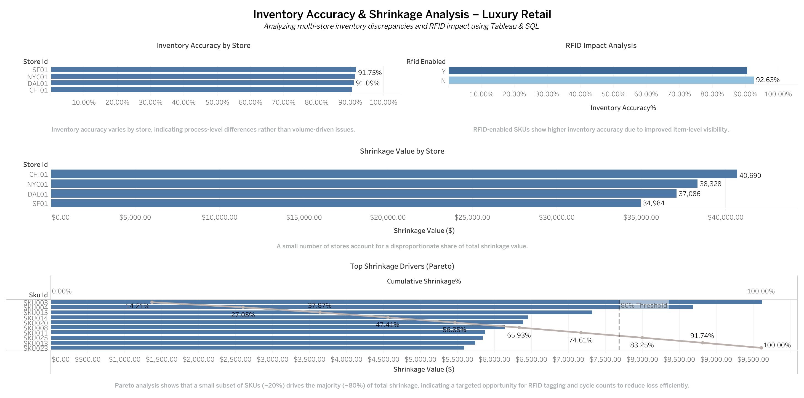

# Inventory Accuracy & Shrinkage Analysis – Luxury Retail

## Overview
This project analyzes multi-store inventory accuracy and shrinkage in a luxury retail environment.
Using PostgreSQL-style SQL and Tableau, the analysis identifies inventory discrepancies, quantifies
financial risk, evaluates RFID impact, and applies Pareto analysis to prioritize high-risk SKUs.

## Business Problem
Luxury retailers manage high-value inventory across multiple stores, where small inaccuracies can
lead to lost sales, excess stock, and margin erosion. This project demonstrates how data analytics
can be used to improve inventory visibility and decision-making.

## Dataset
- Multi-store inventory snapshot
- System quantity vs physical quantity
- SKU-level unit cost
- RFID enablement indicator

File: `data/multi_store_inventory_dataset.csv`

## Tools Used
- PostgreSQL (SQL analysis)
- Tableau (data visualization & storytelling)
- Excel (data review)

## Key Analyses
### 1. Inventory Accuracy by Store
- Measured accuracy using absolute variance between system and physical counts
- Identified stores with process-level discrepancies

### 2. Shrinkage Value Analysis
- Converted inventory variance into financial impact
- Highlighted stores contributing most to total shrinkage

### 3. RFID Impact Analysis
- Compared RFID-enabled vs non-RFID SKUs
- Demonstrated higher accuracy for RFID-enabled items

### 4. Pareto (80/20) Shrinkage Analysis
- Identified a small subset of SKUs driving the majority of shrinkage value
- Enabled targeted inventory control recommendations

## Dashboard

Tableau Public Link: (https://public.tableau.com/app/profile/harshil.vasavada7838/viz/Inventory_Analytics_Luxury_Retail/Dashboard1?publish=yes)

## Business Recommendations
- Expand RFID adoption for high-value SKUs
- Prioritize inventory audits for top shrinkage-driving items
- Use financial impact metrics to guide inventory decisions

## Why This Project Matters
This project bridges hands-on retail operations experience with data-driven supply chain analytics,
demonstrating the ability to translate operational data into actionable insights.
